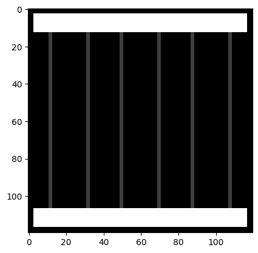
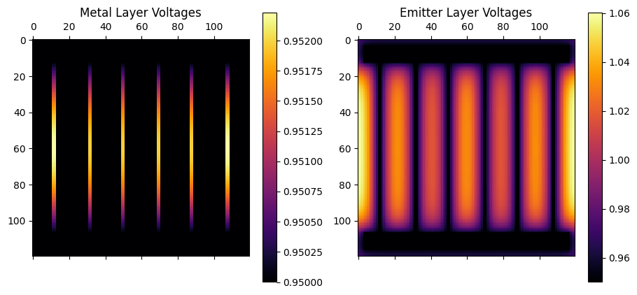
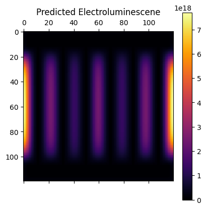

Quasi-3D solar cell solver
==========================

- Example: :doc:`CPV Grid Spice Example (IPython Notebook) <../Examples/cpv_grid_spice_example.ipynb>`
- Example: :doc:`CPV Grid Spice Example (Python) <../Examples/cpv_grid_spice_example.py>`

The quasi-3D solar cell model included in Solcore uses a SPICE-based electrical network to model the flow of injected current through the solar cell. The plane of the cell is discretized into many elements, each of them representing a small portion of the cell. Depending on the location of the element - exposed to the sunlight or underneath a metal finger - the IV curve of the cell will be the light IV or the dark IV. Each element is linked to their neighbours with resistors, representing the lateral current flow and dependent on the sheet resistance of the cells. This method can be applied to any number of junctions.

This type of formalism is widely used to simulate the performance of solar cells when the effect of a spatial variable needs to be incorporated in the model. This variable can be the design of the front metal grid, in order to minimise the effect of series resistances; the inhomogeneous illumination profile in concentrator devices; the impact of such inhomogeneity on the transport through the tunnel junctions; or the distribution of defects or inhomogeneities. Recently, this formalism was used to model the photoluminescence and the electroluminescence based IV curves of MJ devices, accounting for the limited lateral carrier transport.

Specifically for the modelling and optimization of the front grid of solar cells in order to minimise shading losses and series resistance, there are two packages already available: `PVMOS <https://github.com/IEK-5/PVMOS>`_, developed by B. E. Pieters in C and released as open source, and `Griddler <https://www.pvlighthouse.com.au/cms/simulation-programs/griddler>`_, developed by J. Wong using Matlab and available at PV Lighthouse.

.. image:: quasi3Dimg.png
    :align: center

In-plane discretization
-----------------------

There are two physical regions in the plane: the metal and the aperture. These two are provided to Solcore as a
grey scale image that defines a mapping between pixels and the layers:
* Metal:
    * _White_ is a bus bar (value >=80% white)
    * _Gray_ is a grid finger (20% white < value < 80% white)
* Aperture:
    * _Black_ is an absence of any metal  (value <= 20% white)
    
`GridPattern` helper objects can be used to generate these images, for example,

    bus_px = 10  # The width of the bus bar
    fingers_px =  [4, 4, 4, 4, 4, 4] # the number and width of the grid fingers
    offset_px = 3 # the edge offset (metal does not go fully to the edges)
    nx, ny = 120, 120 # the size of the image in pixels
    size = (0.01, 0.01)  # the physical size of the solar cell in metres
    grid = HGridPattern(bus_px, fingers_px, offset_px=offset_px, nx=nx, ny=ny)
    plt.imshow(grid.as_array(), cmap="gray")

The resolution of the images, in pixels, will define the in-plane discretization. However, the physical size
of the solar cell needs to be specified to give each pixel dimensions. For
example, providing an image of 120px x 120px and a size tuple `size = (0.01, 0.01)` (see above) would make each pixel :math:`1cm / 120 \appox 83 micrometers`. Different aspect ratios can be
used to reduce the number of elements and improve speed by specifying a different cell size.

The above code generates the image,

Currently only `HGridPattern` exists, but other grids can be generated by subclass the `GridPattern` object and implementing the required methods.

Note that, no electrical or optical difference exists between bus bar and grid finger. The only difference is that bus bar are used in the SPICE model as connections points to the voltage source that is sweept to generate the cells IV curve. Thus bus bars always have the applied voltage where as the voltage of grid fingers is subject to the current flowing through the cell.

The minimum total number of nodes where SPICE will need to calculate the
voltages will be
N\ :math:`\times`\ M\ :math:`\times`\ 2\ :math:`\times`\ Q, with N and M
the number of pixels in both in-plane directions and Q the number of
junctions, which require 2 nodes each. To this, the front and back metal
contacts could add a maximum of 2(N\ :math:`\times`\ M) nodes. Exploiting
symmetries of the problem as well as choosing an appropriate pixel
aspect ratio will significantly reduce the number of nodes and therefore
the time required for the computation of the problem.

Illumination Map
----------------

The spatial distribution of illumination over the solar cells surface can be include in the simulation using an illimination map array.

This is an numpy array with the same dimensions as the grid pattern. For example,

    # Homogeneous illumination
    illumination_map = np.ones(nx * ny).reshape((nx, ny))

following on from the previous code example, this will construct an array of size 120x120 where each cell has value of 1, thus providing homogeneous illumination across the surface. The intensity of light is specified later, this is why the illumination map contains normalised values (ranging between 1 and 0).

Vertical discretization
-----------------------

The vertical discretization relies on assembling different SPICE unit cells to correctly represent the structure. Internally each SPICE unit cell is a Python object, these are first assembled into a 3D grid of object and then processed to derive the netlist. These objects are contained in the module,

- Unit Cell Module: :doc:`solcore/spice/model.py <../solcore/spice/model.py>`

We closely follow the model of M. Steiner et al., "Validated front contact grid simulation for GaAs solar cells under concentrated sunlight", Progress in Photovoltaics, Volume 19, Issue 1, January 2011, Pages 73-83. DOI: 10.1002/pip.989. Please review the paper for an understanding how the model function. In this document we will discuss how to use the SolCore implementation.

Define a function dictionary for each cell in the structure. For example, a single-junction solar cell can be defined as,

    junctions = [
            {
                "jsc": 30000,
                "emitter_sheet_resistance": 100.0,
                "j01": 4e-16,
                "j02": 2e-7,
                "Eg": 1.41,
                "n1": 1.0,
                "n2": 2.0
            }
        ]

The parameters are:
* `jsc`, the short-circuit current generated by the junction in A / m2.
* `emitter_sheet_resistance`, the sheet resistance of the emitter region in Ohm per square.
* `j01`, the saturation current density in the neutral region in A / m2.
* `j02`, the saturation current density in the bulk region in A / m2.
* `Eg`, the bandgap of the material in eV (this one is no SI units!).
* `n1`, the ideality factor of the `j01` diode, default is 1.
* `n2`, the ideality factor of the `j02` diode, default is 2.

Note that shunt resistance is not currently included in this modelling because for concentrator solar cells and is so large as to be negligible, but it could be added.

Generate Netlist
----------------

Use the `generate_netlist` function to process all the inputs discussed so far to a SPICE net list,

    netlist = generate_netlist(
        grid,
        illumination_map,
        size,
        junctions,
    )

Netlist generation is highly efficient, no "wires" are needed to connect the unit cells together. Instead the cells are connected by proper use of net labels. This seems to have improved the solved speed over previous implementations.

Note
====

The base layer and rear contact layers are not modelled as distributed elements. This has been done to follow the implementation of Steiner and also speeds up computation time.

Solve Netlist
-------------

The netlist is solved by stepping the voltage to find the maximum power point,

    v_start = -0.1  # the starting voltage of the sweep
    v_stop = 1.5  # the end voltage of the sweep
    v_step = 0.01  # the step size of the sweep
    result = solve_netlist(netlist, temperature, v_start, v_stop, v_step)

The module provides functions that process and plot the `result` object to return useful information. For example, the IV curve,

    v, i = get_characterisic_curve(result)
    plot_characteristic_curve(v, i)

The maximum power point,

    vmax, pmax, maxidx = get_maximum_power_point(result)
    # vmax = the voltage at the maximum power point
    # pmax = the maximum power
    # maxidx = the index in the IV curve of the maximum power point

Layer voltage can be plotted to show voltage maps,

    voltages = get_node_voltages(result)
    voltages.shape  # (120, 120, 3, 161)

Here, `voltages` is a 3 + 1 dimensional array. The first three dimensions correspond to the physical x, y, and z locations in the discretization, and the last dimension corresponds to the number of steps in the voltage sweep.

The first z index is the metal layer, the second z index is the PV (emitter) layer, and the third is the base and buffer layers.

The helper function plots both the metal and PV layer voltages,

    plot_surface_voltages(voltages, bias_index=maxidx)

A generalised Planck estimate of the electroluminescence intensity can be made using,

    pv_layer_idx = 1  # index = 1 is the PV layer
    pv_layer_voltages = voltages[:, :, pv_layer_idx, maxidx]
    el = get_electroluminescence(pv_layer_voltages, is_metal=grid.is_metal)
    plot_electroluminescence(el)

Note, some additional information is needed to mask off the metal layers such that the image predicts what might be actually seen.

A Detailed Example
------------------

Let's create a Solcore solar cell model based on the solar cell structure above and get it to calculate the short-circuit current.

    from solcore.structure import Junction
    from solcore.solar_cell import SolarCell
    from solcore.solar_cell_solver import solar_cell_solver
    from solcore.light_source import LightSource

    def get_jsc(concentrationX):
        junction_model = Junction(
            kind='2D',
            T=temperature,
            reff=1,
            jref=300,
            Eg=1.4,
            A=1,
            R_sheet_top=100,
            R_sheet_bot=1e-16,
            R_shunt=1e16,
            n=3.5
        )

        solar_cell_model = SolarCell([junction_model], T=temperature)
        wl = np.linspace(350, 2000, 301) * 1e-9
        light_source = LightSource(
            source_type="standard",
            version="AM1.5g",
            x=wl,
            output_units="photon_flux_per_m",
            concentration=concentrationX
        )

        options = {
            "light_iv": True,
            "wavelength": wl,
            "light_source": light_source,
            "optics_method": "BL"
        }
        solar_cell_solver(solar_cell_model, 'iv', user_options=options)

        jsc = solar_cell_model(0).jsc
        return jsc

    # Get the JSC for 100x concentration
    jsc = get_jsc(100)

Create a second function that wraps the SPICE model and returns the device's efficiency. Inside this function, it calls solcore to estimate the JSC using the above `get_jsc` function,

    def get_efficiency(concentrationX, power_in=1000.0):
        
        bus_px = 10
        fingers_px =  [4, 4, 4, 4, 4, 4]
        offset_px = 3
        nx, ny = 120, 120
        grid = HGridPattern(bus_px, fingers_px, offset_px=offset_px, nx=nx, ny=ny)

        # Homogeneous illumination
        illumination_map = np.ones(nx * ny).reshape((nx, ny))

        # The size of the solar is 3mm x 3mm
        size = (0.003, 0.003) # meters

        # Define a list of properies that describe each junction in the solar cell.
        # NB: currently only one junction is working.
        junctions = [
            {
                "jsc": get_jsc(concentrationX),  # solcore is calculating this for us!
                "emitter_sheet_resistance": 100.0,
                "j01": 4e-16,
                "j02": 2e-7,
                "Eg": 1.41,
                "n1": 1.0,
                "n2": 2.0
            }
        ]

        temperature = 300.0

        netlist = generate_netlist(
            grid,
            illumination_map,
            size,
            junctions,
            temperature=temperature
        )

        result = solve_netlist(netlist, temperature, 0.0, 1.5, 0.01)

        vmax, pmax, maxidx = get_maximum_power_point(result)
        
        p_per_m2 = pmax / size[0] / size[1]
        efficiency = p_per_m2 / (concentrationX * power_in)
        return efficiency

Finally, let's loop over a few concentration values to see if we can plot a concentration vs. efficiency plot.

    effs = list()
    x_values = [1, 10, 100, 200, 500, 1000]
    for x in x_values:
        effs.append(get_efficiency(x))

    plt.semilogx(x_values, 100 * np.array(effs))
    plt.grid(linestyle="dotted")
    plt.xlabel("Concentration")
    plt.ylabel("Efficiency (%)")
    plt.show()

Netlist Generation and Solution Functions
-----------------------------------------

.. automodule:: solcore.spice.netlist
    :members:
    :undoc-members:

Result Processing and Plotting Functions
----------------------------------------

.. automodule:: solcore.spice.result
    :members:
    :undoc-members:

Spice Unit Cell Model Objects
-----------------------------

.. automodule:: solcore.spice.model
    :members:
    :undoc-members:

Grid Generation Objects
-----------------------

.. automodule:: solcore.spice.grid
    :members:
    :undoc-members: